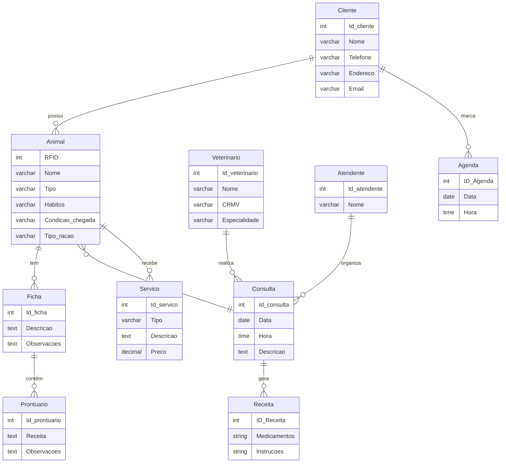
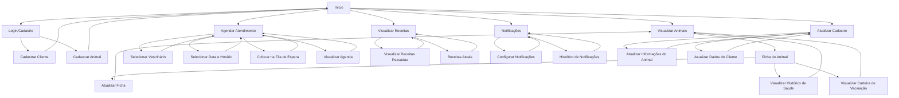

# Repositório de Eng. de Software

#### Repositório, Gerência de proj sw. 2024/2

- [Repositório de Eng. de Software](#repositório-de-eng-de-software)
      - [Repositório, Gerência de proj sw. 2024/2](#repositório-gerência-de-proj-sw-20242)
- [1. Introdução](#1-introdução)
- [2. Descrição de negócio](#2-descrição-de-negócio)
- [3. Visão geral do sistema](#3-visão-geral-do-sistema)
- [4. Diagrama ER](#4-diagrama-er)
- [5. Diagrama de classe](#5-diagrama-de-classe)
- [6. Casos de uso](#6-casos-de-uso)
- [6.2. Histórias de Usuário](#62-histórias-de-usuário)
    - [História 1: Cadastro de Clientes e Animais](#história-1-cadastro-de-clientes-e-animais)
    - [História 2: Informar Condições do Animal](#história-2-informar-condições-do-animal)
    - [História 3: Informar Tipo de Ração e Hábitos](#história-3-informar-tipo-de-ração-e-hábitos)
    - [História 4: Agendamento de Consultas e Serviços](#história-4-agendamento-de-consultas-e-serviços)
    - [História 5: Receber Atendimento na Chegada](#história-5-receber-atendimento-na-chegada)
    - [História 6: Verificar Agenda e Fila de Espera](#história-6-verificar-agenda-e-fila-de-espera)
    - [História 7: Realizar Entrevista com o Dono do Animal](#história-7-realizar-entrevista-com-o-dono-do-animal)
    - [História 8: Registrar Observações e Gerar Prontuário](#história-8-registrar-observações-e-gerar-prontuário)
    - [História 9: Gerar Receita Médica](#história-9-gerar-receita-médica)
    - [História 10: Serviços de Banho e Tosa](#história-10-serviços-de-banho-e-tosa)
    - [História 11: Cirurgias, Injeções e Curativos](#história-11-cirurgias-injeções-e-curativos)
    - [História 12: Escolher Serviço de Pintura de Cachorro](#história-12-escolher-serviço-de-pintura-de-cachorro)
    - [História 13: Serviços de Fisioterapia e Nutrição](#história-13-serviços-de-fisioterapia-e-nutrição)
    - [História 14: Auxílio para Animais com Sobrepeso](#história-14-auxílio-para-animais-com-sobrepeso)
    - [História 15: Receber Notificações de Consulta e Serviços](#história-15-receber-notificações-de-consulta-e-serviços)
    - [História 16: Visualizar Animais, Fichas e Receitas](#história-16-visualizar-animais-fichas-e-receitas)
    - [História 17: Atualizar Cadastro do Animal](#história-17-atualizar-cadastro-do-animal)
    - [História 18: Acessar Carteira de Vacinação e Receber Lembretes](#história-18-acessar-carteira-de-vacinação-e-receber-lembretes)
    - [História 19: Lembretes Automáticos de Medicamentos](#história-19-lembretes-automáticos-de-medicamentos)
    - [História 20: Recomendações Personalizadas de Ração e Suplementos](#história-20-recomendações-personalizadas-de-ração-e-suplementos)
- [7. Diagrama de componentes](#7-diagrama-de-componentes)
- [8. Diagramas de implantação](#8-diagramas-de-implantação)
- [9. Protótipo de telas](#9-protótipo-de-telas)
- [10. Diagrama de navegação de telas](#10-diagrama-de-navegação-de-telas)
- [11. Pilha tecnológica](#11-pilha-tecnológica)
- [12. Requisitos de sistemas](#12-requisitos-de-sistemas)
  - [12.1. Requisitos do lado do cliente](#121-requisitos-do-lado-do-cliente)
  - [12.2. Requisitos do lado do servidor](#122-requisitos-do-lado-do-servidor)
- [13. Considerações sobre segurança](#13-considerações-sobre-segurança)
  - [13.1. Considerções do lado do cliente](#131-considerções-do-lado-do-cliente)
  - [13.2. Considerções do lado do servidor](#132-considerções-do-lado-do-servidor)
- [14. Manutenção, instalação e Novas funcionalidades](#14-manutenção-instalação-e-novas-funcionalidades)
  - [14.1. Instalação](#141-instalação)
  - [14.2. Manutenção](#142-manutenção)
  - [14.3. Planos de contingência](#143-planos-de-contingência)
  - [14.4. Procedimentos Pós-Instalação](#144-procedimentos-pós-instalação)
  - [14.5. Monitoramento Lado Cliente e Servidor](#145-monitoramento-lado-cliente-e-servidor)
  - [14.6. Critérios de Backup e Restore](#146-critérios-de-backup-e-restore)
  - [14.7. Suporte ao Usuário e Critérios de Atendimento](#147-suporte-ao-usuário-e-critérios-de-atendimento)
- [15. Treinamento](#15-treinamento)
  - [15.1. Treinamento para Usuários (Clientes e Veterinários)](#151-treinamento-para-usuários-clientes-e-veterinários)
  - [15.2. Treinamento para Administradores](#152-treinamento-para-administradores)
- [16. Script SQL](#16-script-sql)
  - [16.1. Comandos CREATE table](#161-comandos-create-table)
  - [16.2. Comandos INSERT table](#162-comandos-insert-table)


# 1. Introdução

O projeto a seguir descreve o desenvolvimento de um sistema personalizado para um petshop. Considerada uma microempresa em fase inicial, a empresa identificou que as soluções de mercado existentes não atendiam às suas necessidades específicas devido à natureza exclusiva de seus serviços. Como resultado, os proprietários decidiram criar uma solução sob medida que se ajustasse perfeitamente às suas operações.

A seguir, detalhamos a solução proposta, que visa atender às necessidades únicas da empresa e proporcionar uma gestão mais eficiente e eficaz dos serviços oferecidos pelo petshop.

# 2. Descrição de negócio

Descrição do cenário onde o sistema deve funcionar:
 
**1. Uma clínica veterinária atende animais domésticos (gatos e cachorros) e silvestres liberados pelo Ibama (aves como a cacatua e a calopsita, jabutis, iguanas, cobras e furões).**

**2. Marcar animais com RFID.**
   
**3. Os clientes devem fazer um cadastro de si e dos animais.**

**4. Os clientes devem informar as condições nas quais os animais chegam.**

**5. Os clientes devem informar o tipo de ração que o animal come.**

**6. O cliente deve informar hábitos do animal.**

**7. Para cada animal é possível que mais de um veterinário o atenda.**


**8. Os animais podem chegar e serem atendidos de acordo com uma agenda do dia.**

**9.  Cada animal atendido receberá uma ficha e um prontuário.**

**10. Outros dono podem querer marcar horários de atendimento futuro.**

**11. O atendimento gera uma receita para o animal.**

**12. Quando um cliente chega na clínica veterinária ele é atendido por um atendente.** 

**13. O atendente deve verificar se existe agenda disponível com um veterinário.** 

**14. O atendente deve colocar o cliente e seu animal na fila de espera, se for o caso.**

**15. O atendente deve levar o cliente e o animal até o veterinário.**

**16. O veterinário deve realizar uma entrevista com o dono do animal.**

**17. O resultado da entrevista deve ir para um formulário.**

**18. O veterinário deverá examinar o animal e anotar em prontuário(ficha) suas observações.**

**19. Dependendo da situação do animal este receberá uma receita.**

**20. O pet shop oferece serviços de banho e tosa.**

**21. A pet shop realiza cirurgias, injeções e curativos.**

**22. O cliente pode escolher se quer o serviço de pintura de cachorro**

**23. São oferecidos serviços de fisioterapia e nutrição**

**24. O sistema deve permitir que o cliente possa visualizar seus animais e suas fichas.**

**25. O sistema deve permitir que o cliente possa visualizar suas receitas.**

**26. A pet shop tem serviços para auxiliar os donos de animais com sobrepeso.**

**27. O cliente pode receber notificações via SMS ou e-mail quando a consulta ou serviço estiver próximo.**

**28. O sistema deve permitir que o cliente atualize o cadastro do animal a qualquer momento, como mudança de hábitos ou troca de ração.**

**29. O cliente deverá ter acesso a carteira de vacinação do animal, bem como ser avisado de vacinas obrigatórias quando próximas.**

**30. O sistema deve emitir lembretes automáticos sobre a próxima dose de medicamentos prescritos para o animal e permitir o cliente confirmar se deu o medicamento ao animal.**

**31. O cliente pode visualizar recomendações personalizadas de ração e suplementos com base no histórico de saúde do animal.**

# 3. Visão geral do sistema

O sistema atende às necessidades dos clientes nas seguintes funcionalidades:

**1. Cadastro e Gerenciamento de Informações do Animal**
   
- Cadastro Rápido: O cliente realiza um cadastro pessoal e dos animais, incluindo dados como tipo de ração, condições de saúde e hábitos.
- Atualização de Dados: O cliente pode atualizar informações como mudanças de hábitos ou troca de ração a qualquer momento.
- Histórico e Recomendações: Com base no histórico de saúde do animal, o sistema fornece recomendações personalizadas de rações e suplementos.

**2. Agendamento de Consultas e Serviços**
   
- Agendamentos Simples: O cliente agenda atendimentos, como consultas, cirurgias, fisioterapia, e serviços de banho e tosa diretamente no sistema.
- Visualização de Agenda: O cliente tem uma visão clara dos próximos compromissos e pode agendar com antecedência, garantindo que o animal seja atendido no horário desejado.
- Notificações e Lembretes: Antes de cada consulta ou serviço, o cliente recebe notificações automáticas via SMS ou e-mail, lembrando-o da data e horário.

**3. Acompanhamento em Tempo Real do Atendimento**

- Check-in e Fila de Espera: Quando o cliente chega à clínica, ele faz um check-in com o atendente e, se necessário, aguarda na fila de espera.
- Entrevista e Avaliação Veterinária: Durante a consulta, o veterinário realiza uma entrevista com o cliente e registra informações na ficha do animal, permitindo um acompanhamento detalhado do atendimento.

**4. Ficha Médica e Prontuário Completo**

- Acesso ao Prontuário: O cliente tem acesso à ficha médica do animal, onde pode consultar todas as observações e diagnósticos registrados pelo veterinário.
- Visualização de Receitas e Tratamentos: O sistema permite ao cliente acessar e baixar receitas emitidas pelo veterinário, assim como detalhes sobre medicamentos e tratamentos recomendados.

**5. Gestão de Vacinação e Medicamentos**

- Carteira de Vacinação Digital: O cliente tem acesso à carteira de vacinação do animal, visualizando vacinas já aplicadas e as próximas a serem tomadas.
- Lembretes de Vacinação e Medicamentos: O sistema emite lembretes automáticos para vacinas obrigatórias e doses de medicamentos, permitindo que o cliente confirme se a medicação foi administrada.

**6. Serviços Especializados e Personalizados**

- Banho, Tosa e Pintura: A plataforma oferece serviços opcionais como pintura de pelagem para cachorros, além de banho e tosa.
- Suporte Nutricional e para Animais com Sobrepeso: Serviços de nutrição e fisioterapia ajudam donos a cuidarem melhor de animais que precisam de cuidados especiais, como controle de peso.

**7. Comunicação e Notificações**

- Alertas Personalizados: O sistema envia alertas e recomendações personalizadas, mantendo o cliente informado sobre a saúde do animal e facilitando a gestão dos cuidados.
- Confirmação de Medicamentos: Após o envio de lembretes de medicamentos, o sistema permite ao cliente confirmar o uso, facilitando o acompanhamento do tratamento.

**8. Interface Amigável e Acessível**

- Visualização Completa: Em uma interface amigável, o cliente consegue gerenciar todos os dados dos animais e acompanhar o histórico de serviços e atendimentos realizados na clínica.
- Acesso Simplificado: O sistema permite um acesso fácil às fichas médicas, receitas e histórico de vacinas, facilitando o acompanhamento da saúde do animal.

# 4. Diagrama ER


# 5. Diagrama de classe


# 6. Casos de uso

# 6.2. Histórias de Usuário


### História 1: Cadastro de Clientes e Animais
**Como** cliente,  
**Quero** me cadastrar e cadastrar meus animais na clínica veterinária,  
**Para** que eu possa utilizar os serviços oferecidos.

### História 2: Informar Condições do Animal
**Como** cliente,  
**Quero** informar as condições nas quais meus animais chegam à clínica,  
**Para** que os veterinários possam oferecer o atendimento adequado.

### História 3: Informar Tipo de Ração e Hábitos
**Como** cliente,  
**Quero** informar o tipo de ração e os hábitos alimentares e comportamentais dos meus animais,  
**Para** que o veterinário tenha mais informações sobre a saúde e bem-estar deles.

### História 4: Agendamento de Consultas e Serviços
**Como** cliente,  
**Quero** agendar atendimentos futuros para meus animais,  
**Para** garantir que eles sejam atendidos no horário desejado.

### História 5: Receber Atendimento na Chegada
**Como** cliente,  
**Quero** ser atendido por um atendente ao chegar na clínica,  
**Para** garantir que meu animal seja colocado na fila de espera e atendido rapidamente.

### História 6: Verificar Agenda e Fila de Espera
**Como** atendente,  
**Quero** verificar a agenda disponível dos veterinários e colocar os clientes na fila de espera,  
**Para** organizar o atendimento conforme as prioridades do dia.

### História 7: Realizar Entrevista com o Dono do Animal
**Como** veterinário,  
**Quero** realizar uma entrevista com o dono do animal,  
**Para** coletar informações importantes para o atendimento.

### História 8: Registrar Observações e Gerar Prontuário
**Como** veterinário,  
**Quero** registrar minhas observações e gerar o prontuário do animal após o exame,  
**Para** manter o histórico de saúde atualizado.

### História 9: Gerar Receita Médica
**Como** veterinário,  
**Quero** gerar uma receita médica após o atendimento do animal,  
**Para** prescrever os medicamentos necessários para o tratamento.

### História 10: Serviços de Banho e Tosa
**Como** cliente,  
**Quero** agendar serviços de banho e tosa para meus animais,  
**Para** que eles fiquem limpos e cuidados.

### História 11: Cirurgias, Injeções e Curativos
**Como** cliente,  
**Quero** solicitar cirurgias, injeções e curativos para meus animais,  
**Para** atender a necessidades médicas especiais.

### História 12: Escolher Serviço de Pintura de Cachorro
**Como** cliente,  
**Quero** escolher o serviço de pintura para meu cachorro,  
**Para** personalizar a aparência do meu pet.

### História 13: Serviços de Fisioterapia e Nutrição
**Como** cliente,  
**Quero** agendar serviços de fisioterapia e nutrição para meu animal,  
**Para** garantir o bem-estar e a recuperação física dele.

### História 14: Auxílio para Animais com Sobrepeso
**Como** cliente,  
**Quero** acessar serviços especializados para auxiliar meu animal com sobrepeso,  
**Para** garantir sua saúde e qualidade de vida.

### História 15: Receber Notificações de Consulta e Serviços
**Como** cliente,  
**Quero** receber notificações via SMS ou e-mail quando a consulta ou serviço estiver próximo,  
**Para** que eu não perca os compromissos agendados.

### História 16: Visualizar Animais, Fichas e Receitas
**Como** cliente,  
**Quero** visualizar meus animais, suas fichas e as receitas emitidas,  
**Para** acompanhar o histórico médico e de atendimento.

### História 17: Atualizar Cadastro do Animal
**Como** cliente,  
**Quero** atualizar o cadastro do meu animal a qualquer momento,  
**Para** registrar mudanças de hábitos ou ração.

### História 18: Acessar Carteira de Vacinação e Receber Lembretes
**Como** cliente,  
**Quero** acessar a carteira de vacinação do meu animal e receber lembretes de vacinas obrigatórias,  
**Para** garantir que as vacinas estejam sempre em dia.

### História 19: Lembretes Automáticos de Medicamentos
**Como** cliente,  
**Quero** receber lembretes automáticos sobre a próxima dose de medicamentos prescritos e confirmar que dei o remédio ao meu animal,  
**Para** garantir que o tratamento seja seguido corretamente.

### História 20: Recomendações Personalizadas de Ração e Suplementos
**Como** cliente,  
**Quero** visualizar recomendações personalizadas de ração e suplementos com base no histórico de saúde do meu animal,  
**Para** garantir que ele esteja recebendo a melhor nutrição possível.


# 7. Diagrama de componentes


# 8. Diagramas de implantação


# 9. Protótipo de telas

# 10. Diagrama de navegação de telas



# 11. Pilha tecnológica


# 12. Requisitos de sistemas
## 12.1. Requisitos do lado do cliente

**1. Cadastro de Cliente:**

- O cliente deve poder realizar o cadastro no sistema, informando seus dados pessoais (nome, endereço, telefone, e-mail, etc.).

**2. Cadastro de Animal:**

- O cliente deve cadastrar seus animais no sistema, fornecendo informações como espécie, raça, idade, condições físicas, hábitos e tipo de ração consumida.
- O cliente pode atualizar o cadastro do animal a qualquer momento, como mudanças de hábitos ou troca de ração.

**3. Consulta de Fichas e Prontuários:**

- O cliente pode visualizar o histórico médico e as fichas de atendimento de cada um de seus animais.

**4. Visualização de Receitas:**

- O cliente pode acessar as receitas médicas emitidas após o atendimento dos seus animais.

**5. Agendamento de Consultas e Serviços:**

- O cliente deve poder agendar consultas com veterinários e serviços como banho, tosa, fisioterapia, cirurgias, entre outros.
- O cliente deve ser informado sobre a disponibilidade de horários e poderá marcar consultas futuras.

**6. Fila de Espera e Notificações:**

- O sistema deve notificar o cliente via SMS ou e-mail quando uma consulta ou serviço estiver próximo.
- O cliente deve ser informado se for necessário esperar para o atendimento, sendo notificado quando o animal estiver próximo de ser atendido.

**7. Acesso à Carteira de Vacinação:**

- O cliente deve ter acesso à carteira de vacinação do animal, contendo as vacinas aplicadas e as vacinas obrigatórias pendentes.

**8. Lembretes de Vacinas e Medicamentos:**

- O cliente será avisado quando uma vacina obrigatória estiver próxima.
- O sistema deve emitir lembretes automáticos para a próxima dose de medicamentos prescritos e permitir que o cliente confirme se administrou o medicamento ao animal.

**9. Serviços Personalizados:**

- O cliente pode visualizar recomendações personalizadas de ração e suplementos com base no histórico de saúde e necessidades nutricionais do animal.
- O cliente deve poder contratar serviços auxiliares para animais com sobrepeso.

**10. Atualização de Cadastro e Preferências:**

- O cliente poderá modificar as informações do seu cadastro e do animal a qualquer momento, como a mudança de hábitos ou troca de ração.
Confirmação de Serviço de Pintura de Cachorro:
- O cliente deve poder optar pelo serviço de pintura de cachorro durante o agendamento de banho e tosa.

## 12.2. Requisitos do lado do servidor

**1. Gerenciamento de Cadastro de Clientes e Animais:**

- O sistema deve permitir ao servidor criar, editar e excluir cadastros de clientes e seus animais.
- O sistema deve permitir a inclusão de detalhes sobre os hábitos, condições físicas e ração dos animais.
- Deve ser possível ao servidor marcar animais com RFID para rastreamento e identificação.

**2. Gerenciamento de Prontuários e Fichas Médicas:**

- O servidor deve armazenar e manter fichas de atendimento e prontuários médicos de cada animal, registrando observações, diagnósticos e tratamentos recomendados.
- O sistema deve permitir a consulta e atualização das fichas durante ou após os atendimentos.

**3. Agenda de Consultas e Serviços:**

- O sistema deve manter uma agenda de atendimento de veterinários, permitindo ao servidor marcar horários para consultas, cirurgias, banho e tosa, e outros serviços.
- Deve ser possível ao servidor gerenciar a fila de espera dos animais e ajustar a agenda conforme necessário.

**4. Verificação de Disponibilidade de Veterinários:**

- O sistema deve verificar automaticamente a disponibilidade dos veterinários para novos atendimentos e consultas com base na agenda do dia.
- Se não houver disponibilidade imediata, o sistema deve permitir colocar o cliente e o animal na fila de espera.

**5. Entrevista e Avaliação do Veterinário:**

- O servidor deve registrar as respostas do cliente durante a entrevista realizada pelo veterinário, garantindo que as informações sejam armazenadas no prontuário do animal.
- As anotações do exame físico e observações clínicas devem ser inseridas no sistema pelo veterinário.

**6. Emissão de Receitas Médicas:**

- O sistema deve permitir que o veterinário emita receitas médicas para os animais após os atendimentos.
- Essas receitas devem ser vinculadas ao prontuário do animal e estar acessíveis ao cliente.

**7. Serviços de Banho, Tosa e Outros Procedimentos:**

- O servidor deve gerenciar serviços de banho, tosa, fisioterapia, nutrição, cirurgias e curativos.
- O sistema deve permitir que o servidor registre a execução desses serviços e associe-os ao prontuário do animal.

**8. Notificações e Lembretes Automatizados:**

- O sistema deve enviar automaticamente notificações ao cliente via SMS ou e-mail quando uma consulta ou serviço estiver próximo.
- O sistema deve emitir lembretes automáticos sobre vacinas e próximas doses de medicamentos, notificando o cliente e permitindo o acompanhamento do status da medicação.

**9. Manutenção da Carteira de Vacinação:**

- O servidor deve poder inserir informações sobre as vacinas aplicadas e emitir lembretes automáticos sobre vacinas obrigatórias que estejam próximas.
- A carteira de vacinação deve ser atualizada com cada nova aplicação.

**10. Recomendações Personalizadas de Ração e Suplementos:**

- O sistema deve fornecer ao servidor a capacidade de gerar recomendações personalizadas de ração e suplementos com base no histórico de saúde dos animais.
- Essas recomendações devem ser exibidas automaticamente para o cliente, de acordo com a condição de saúde do animal.
- Gerenciamento de Serviços Personalizados (Ex: Pintura de Cachorro):
- O servidor deve registrar solicitações específicas, como o serviço de pintura de cachorro, e garantir que sejam realizados de acordo com o pedido do cliente.

**11. Emissão de Faturas e Controle Financeiro:**

- O servidor deve gerar uma fatura de todos os serviços prestados (consultas, procedimentos, vendas de produtos) para cada atendimento realizado.
- O sistema deve registrar todas as receitas geradas por animal, vinculando-as ao prontuário e histórico financeiro do cliente.

**12. Atualização de Informações dos Animais:**

- O sistema deve permitir que o servidor edite e atualize as informações do animal a qualquer momento, com base nos dados fornecidos pelo cliente, como mudança de hábitos ou troca de ração.

# 13. Considerações sobre segurança

## 13.1. Considerações do lado do cliente

**1. Autenticação Segura:**

- O sistema deve exigir autenticação por meio de credenciais (usuário e senha) fortes para que os clientes acessem suas contas.
- Recomenda-se a implementação de autenticação multifator (MFA) para adicionar uma camada extra de segurança ao processo de login.

**2. Proteção de Dados Pessoais e de Animais:**

- Todas as informações pessoais do cliente (nome, endereço, telefone, e-mail) e dados sobre os animais (hábitos, condições de saúde, carteira de vacinação) devem ser protegidas com criptografia tanto em trânsito quanto em repouso.
- O sistema deve seguir a Lei Geral de Proteção de Dados (LGPD) ou outras regulamentações locais de privacidade para garantir a conformidade no tratamento e armazenamento desses dados.

**3. Autorização de Acesso:**

- O sistema deve garantir que apenas o cliente registrado possa acessar as informações de seus próprios animais e dados médicos. Qualquer tentativa de acesso não autorizado a essas informações deve ser bloqueada e registrada.

**4. Segurança de Comunicação:**

- Todo o tráfego entre o cliente e o sistema deve ser protegido com HTTPS, utilizando certificados SSL/TLS para garantir que as informações não sejam interceptadas por terceiros mal-intencionados.

**5. Notificações e Lembretes Seguros:**

- As notificações enviadas por SMS ou e-mail, como lembretes de consultas ou vacinas, devem ser cuidadosas em não incluir informações sensíveis diretamente, evitando exposição de dados pessoais ou de saúde dos animais nesses canais.

**6. Gerenciamento de Sessão:**

- O sistema deve encerrar automaticamente as sessões de clientes após um período de inatividade para evitar que terceiros não autorizados possam acessar suas contas, especialmente em dispositivos compartilhados.

**7. Recuperação Segura de Senha:**

- O processo de recuperação de senha deve ser seguro, exigindo validações adequadas, como envio de links de redefinição por e-mail ou perguntas de segurança, para evitar que contas de clientes sejam comprometidas.

**8. Registro de Atividades:**

- O sistema deve registrar todas as atividades críticas realizadas pelo cliente (como login, alterações no cadastro de animais, agendamentos e acesso a prontuários), permitindo auditorias e detecção de atividades suspeitas.

**9. Controle de Acesso às Fichas e Receitas:**

- As fichas de atendimento e receitas médicas dos animais devem ser protegidas, permitindo que apenas o cliente dono do animal as visualize, evitando o compartilhamento não autorizado dessas informações com outros clientes ou terceiros.

## 13.2. Considerações do lado do servidor

**1. Autenticação Segura e Controle de Acesso:**

- O sistema deve exigir que todos os funcionários, como veterinários e atendentes, realizem login com credenciais seguras.
- Deve haver um controle rígido de acesso baseado em funções (RBAC), garantindo que cada funcionário tenha permissão para acessar apenas as informações e funcionalidades necessárias para o seu papel (ex: veterinários acessam prontuários, atendentes não podem editar dados médicos).

**2. Criptografia de Dados:**

- Todos os dados sensíveis, incluindo informações pessoais dos clientes e dados médicos dos animais, devem ser criptografados tanto em trânsito (usando HTTPS/SSL/TLS) quanto em repouso no banco de dados.
- As receitas e prontuários, por conterem informações sensíveis de saúde, devem ser criptografados de maneira que somente usuários autorizados possam acessá-los.

**3. Segurança na Comunicação:**

- As interações entre o servidor e outros sistemas (como serviços de notificação por SMS ou e-mail) devem ser protegidas por meio de APIs seguras com autenticação e criptografia.
- A comunicação entre as camadas de aplicação e banco de dados também deve ser protegida contra interceptações ou ataques de "man-in-the-middle".

**4. Proteção Contra Ataques de Injeção e XSS:**

- O sistema deve ser protegido contra ataques de injeção de SQL ou script (XSS), validando e sanitizando todas as entradas de dados fornecidas pelos usuários, tanto do lado do cliente quanto no backend.
- A aplicação deve empregar prepared statements ou ORM (Object-Relational Mapping) para consultas seguras ao banco de dados, evitando injeção de código malicioso.

**5. Gerenciamento de Sessões e Autenticação:**

- O servidor deve implementar um gerenciamento seguro de sessões, com tokens expiratórios e técnicas como o uso de cookies seguros e protegidos contra CSRF (Cross-Site Request Forgery).
- Sessões de funcionários devem expirar após um período de inatividade, e múltiplas tentativas falhas de login devem acionar bloqueios temporários ou desafios de autenticação, como CAPTCHA ou MFA.

**6. Registro e Monitoramento de Atividades:**

- O servidor deve manter logs de todas as atividades importantes realizadas no sistema, como consultas de prontuários, modificações de cadastro, e geração de receitas.
- O sistema deve ser capaz de identificar e registrar tentativas de acesso não autorizado, comportamento anômalo, e possíveis ataques (por exemplo, tentativas de "force brute" ou "phishing").

**7. Backup e Recuperação de Dados:**

- Implementar uma rotina automatizada de backup dos dados, garantindo a redundância das informações e a recuperação em caso de falhas ou ataques (ex: ransomware).
- Backups devem ser armazenados de forma segura e criptografada, e o acesso a eles deve ser restrito a funcionários autorizados.

**8. Proteção Contra DDoS e Alta Disponibilidade:**

- O sistema deve ser protegido contra ataques de negação de serviço distribuída (DDoS), utilizando soluções de firewall, balanceamento de carga e limitação de solicitações para evitar sobrecarga no servidor.
- Deve-se garantir alta disponibilidade do sistema, implementando servidores redundantes e estratégias de failover para minimizar o tempo de inatividade.

**9. Atualizações e Patches de Segurança:**

- O servidor deve ser constantemente atualizado com patches de segurança para proteger o sistema contra vulnerabilidades conhecidas.
- Todos os componentes de software usados no servidor, incluindo bibliotecas e dependências, devem ser mantidos atualizados.

**10. Segurança na Integração com RFID:**

- O servidor deve garantir que o sistema de marcação de animais com RFID esteja protegido contra clonagem ou adulteração de dados.
- A comunicação entre o sistema de RFID e o servidor deve ser feita de maneira segura, garantindo que os dados de identificação dos animais não sejam comprometidos.

**11. Gerenciamento de Dados e Compliance:**

- O servidor deve garantir a conformidade com leis de proteção de dados (como LGPD ou GDPR), especialmente no armazenamento, processamento e compartilhamento de dados pessoais dos clientes.
- As informações devem ser processadas e armazenadas de forma segura e somente para as finalidades descritas, com mecanismos para anonimização ou pseudonimização de dados sensíveis, quando aplicável.

# 14. Manutenção, instalação e Novas funcionalidades

## 14.1. Instalação

**1. Configuração do Backend e Bibliotecas Terceirizadas:** O sistema será implementado em uma infraestrutura de nuvem (como AWS ou Azure) que permita escalabilidade e suporte para altas demandas de atendimento, considerando a integração com APIs de terceiros para notificações SMS e e-mail, como Twilio ou SendGrid. As bibliotecas de autenticação, como OAuth2 e JWT, também devem ser configuradas para garantir a segurança do acesso.

**2. Instalação e Configuração de Banco de Dados:** PostgreSQL é recomendado para armazenar dados não-relacionais (históricos médicos e fichas de animais) e relacionais (informações de clientes e animais), respectivamente. A configuração do banco inclui indexação dos registros dos animais por RFID, otimizando o tempo de consulta durante o atendimento.

**3. Configuração de RFID:** Instalação dos leitores RFID e integração com o sistema, com drivers e bibliotecas que garantam a comunicação dos leitores com o servidor.

**4. Aplicativos de Dispositivos Móveis:** O sistema possuindo apps para Android ou iOS, os mesmos devem ser disponibilizados nas lojas de aplicativos com configuração para atualizações automáticas e compatibilidade com diversos dispositivos para clientes e veterinários.

## 14.2. Manutenção

**1. Monitoração Contínua:** Implementamos sistemas de monitoração, como o CloudWatch (AWS) ou AppDynamics, para analisar a carga de requisições, identificar possíveis falhas e monitorar o tempo de resposta das funcionalidades. A quantidade de logs gerados deve ser gerenciada e armazenada em um servidor seguro.

**2. Rodízio de Backup:** Realizamos backups automatizados e frequentes das bases de dados. O backup deve seguir um rodízio semanal com restauração garantida para um período de 30 dias e armazenamento seguro dos dados em local separado.

**3. Segurança:** A segurança é um ponto crítico e requer a aplicação contínua de patches e revisão dos sistemas de autenticação. Verificações regulares de comunicação entre cliente e servidor garantem a criptografia e proteção dos dados transmitidos.

**4. Alertas e Testes de Notificação:** É essencial realizar testes regulares das notificações SMS/e-mail e dos lembretes automáticos de consultas, vacinas e medicamentos. Se falharem, alertas devem ser gerados para equipes de manutenção.

## 14.3. Planos de contingência

Para situações de emergência, como falhas no sistema ou interrupções de serviço, o sistema deve oferecer um plano de contingência que envolva:

**1. Plano de Recuperação de Desastres (DRP):** Com backups replicados em diferentes regiões geográficas e políticas de recuperação que garantam a restauração de dados críticos em até 4 horas.

**2. Failover Automático:** Configurar o sistema para failover automático em servidores redundantes, garantindo o mínimo de interrupção no atendimento.

## 14.4. Procedimentos Pós-Instalação

**1. Configuração de Perfis de Usuário e Treinamento:** Criar perfis de acesso para clientes, atendentes e veterinários, com permissões específicas para cada tipo de usuário. Orientar a equipe sobre o uso das funcionalidades e do painel de administração.

**2. Testes de Integração e Estresse:** Realizar testes para garantir que todos os componentes do sistema funcionem integrados, testando o volume de registros e a capacidade de resposta sob carga intensa, além da integração de dispositivos RFID e notificações.

## 14.5. Monitoramento Lado Cliente e Servidor

- **Cliente:** Verificação de atividade do usuário, armazenamento de cache e envio de relatórios de erro. No app, monitorar notificações e a precisão do rastreamento RFID.

- **Servidor:** Controle de carga de CPU, tempo de resposta do banco de dados e geração de logs. Limpeza e arquivamento periódico dos logs devem ocorrer para evitar sobrecarga no armazenamento.

## 14.6. Critérios de Backup e Restore

**1. Periodicidade:** Backups diários para dados críticos, semanais para dados secundários e mensais para arquivos históricos.

**2. Procedimento de Restauração:** Definir tempos de restauração garantidos para diferentes tipos de dados (até 4 horas para dados críticos e 24 horas para históricos).
  
## 14.7. Suporte ao Usuário e Critérios de Atendimento

**1. Formulários de Suporte:** Formular um sistema de suporte no próprio app, com campos específicos para categoria de problema, descrição, e prioridade.

**2. Critérios de Atendimento:** Definir tempos de resposta com base na criticidade do problema (e.g., problemas de autenticação são prioridade alta, enquanto atualizações de cadastro são média).

# 15. Treinamento

## 15.1. Treinamento para Usuários (Clientes e Veterinários)

Os treinamentos ocorrem presencilmente através de técnicos, ou por meio de vídeos ou um base de conhecimento completa.

**1. Introdução ao Sistema e Interface:**

- Visão geral das funcionalidades principais do sistema, como acessar e navegar pelos menus.
- Orientação sobre o painel de controle personalizado, onde os usuários podem ver o histórico dos animais, receitas e recomendações de ração.
  
**2. Cadastro e Atualização de Animais e Clientes:**

- Demonstrar o fluxo de cadastro de clientes e animais, incluindo a inserção de informações como hábitos, tipo de ração e condições de chegada.
- Explicar como atualizar dados, especialmente para mudança de ração ou novos hábitos, e como isso afeta as recomendações.

**3. Agendamento e Gerenciamento de Consultas:**

- Instruir os usuários sobre como visualizar a agenda e marcar horários de consulta para os animais.
-Detalhar o processo de fila de espera para atendimento e acompanhamento de consultas.

**4. Receitas, Lembretes e Vacinação:**

- Explicar como visualizar receitas e prontuários de cada animal, com foco em como interpretar as prescrições.
- Demonstrar o sistema de lembretes automáticos (medicações e vacinas) e como confirmar o cumprimento dessas ações.

**5. Notificações e Preferências de Comunicação:**

- Instruir os usuários a configurarem notificações por SMS ou e-mail, garantindo que estejam cientes das consultas e serviços marcados.
-Orientar sobre o ajuste de preferências de notificação, como lembretes para vacinas e recomendações de saúde.

**6. Serviços da Pet Shop:**

- Explicar como visualizar e agendar serviços como banho, tosa e fisioterapia.
- Capacitar o usuário para explorar e agendar serviços adicionais, como consultas de nutrição e pintura de pets, conforme a oferta da clínica.

## 15.2. Treinamento para Administradores

Os treinamentos ocorrem presencilmente através de técnicos, ou por meio de vídeos ou um base de conhecimento completa.

**1. Instalação e Configuração Inicial:**

- Passo a passo da instalação do sistema, incluindo configurações de dependências (como bibliotecas e RFID).
- Demonstração de como configurar o banco de dados e verificar o funcionamento dos leitores RFID.

**2. Manutenção e Segurança do Sistema:**

- Capacitar sobre a monitoração do sistema, explicando o uso de ferramentas como AppDynamics ou CloudWatch para acompanhar o desempenho e a carga do sistema.
- Realizar sessões sobre procedimentos de segurança, incluindo atualizações de software, verificação de logs e testes de comunicação entre cliente e servidor.

**3. Procedimentos de Backup e Restauração:**

- Instruir sobre a configuração e verificação dos processos de backup automáticos.
- Realizar treinamentos específicos sobre restauração de dados, cobrindo desde backups diários até históricos mensais.

**4. Gestão de Alertas e Notificações:**

- Configurar e monitorar os alertas de notificação para consultas, vacinas e medicações.
- Treinar na resolução de problemas quando os alertas não estão sendo enviados ou entregues corretamente.

**5. Controle de Acesso e Perfis de Usuários:**

- Criar e gerenciar perfis de acesso para diferentes tipos de usuários (clientes, veterinários, atendentes), assegurando permissões adequadas para cada grupo.
- Instruir sobre a definição de privilégios administrativos e controle de acessos sensíveis no sistema.

**6. Resolução de Problemas e Suporte:**

- Treinamento para identificar e solucionar problemas comuns no sistema, com procedimentos detalhados para questões recorrentes.
- Fornecer material de apoio para usuários finais e fluxos de escalonamento para o atendimento de chamados complexos.

# 16. Script SQL

## 16.1. Comandos CREATE table
```sql

CREATE DATABASE IF NOT EXISTS ClinicaVeterinaria;
USE ClinicaVeterinaria;

-- Tabela CLIENTE
CREATE TABLE CLIENTE (
    ID_Pessoa INT AUTO_INCREMENT PRIMARY KEY,
    Nome VARCHAR(100) NOT NULL,
    Telefone VARCHAR(15),
    Endereco VARCHAR(255),
    Email VARCHAR(100) UNIQUE NOT NULL
);

-- Tabela ANIMAL
CREATE TABLE ANIMAL (
    RFID VARCHAR(50) PRIMARY KEY,
    Nome VARCHAR(100) NOT NULL,
    Tipo ENUM('Gato', 'Cachorro', 'Ave', 'Jabuti', 'Iguana', 'Cobra', 'Furão') NOT NULL,
    Habitos TEXT,
    Condicao_chegada TEXT,
    Tipo_racao VARCHAR(100),
    ID_Pessoa INT,
    FOREIGN KEY (ID_Pessoa) REFERENCES CLIENTE(ID_Pessoa)
);

-- Tabela VETERINARIO
CREATE TABLE VETERINARIO (
    ID_Veterinario INT AUTO_INCREMENT PRIMARY KEY,
    Nome VARCHAR(100) NOT NULL,
    CRMV VARCHAR(20) UNIQUE NOT NULL,
    Especialidade VARCHAR(100)
);

-- Tabela ATENDENTE
CREATE TABLE ATENDENTE (
    ID_Atendente INT AUTO_INCREMENT PRIMARY KEY,
    Nome VARCHAR(100) NOT NULL
);

-- Tabela CONSULTA
CREATE TABLE CONSULTA (
    ID_Consulta INT AUTO_INCREMENT PRIMARY KEY,
    Data DATE NOT NULL,
    Hora TIME NOT NULL,
    Descricao TEXT,
    RFID VARCHAR(50),
    ID_Veterinario INT,
    ID_Atendente INT,
    FOREIGN KEY (RFID) REFERENCES ANIMAL(RFID),
    FOREIGN KEY (ID_Veterinario) REFERENCES VETERINARIO(ID_Veterinario),
    FOREIGN KEY (ID_Atendente) REFERENCES ATENDENTE(ID_Atendente)
);

-- Tabela FICHA
CREATE TABLE FICHA (
    ID_Ficha INT AUTO_INCREMENT PRIMARY KEY,
    Descricao TEXT,
    Observacoes TEXT,
    RFID VARCHAR(50),
    FOREIGN KEY (RFID) REFERENCES ANIMAL(RFID)
);

-- Tabela PRONTUARIO
CREATE TABLE PRONTUARIO (
    ID_Prontuario INT AUTO_INCREMENT PRIMARY KEY,
    Receita TEXT,
    Observacoes TEXT,
    RFID VARCHAR(50),
    FOREIGN KEY (RFID) REFERENCES ANIMAL(RFID)
);

-- Tabela SERVICO
CREATE TABLE SERVICO (
    ID_Servico INT AUTO_INCREMENT PRIMARY KEY,
    Tipo ENUM('Banho', 'Tosa', 'Cirurgia', 'Injeção', 'Curativo', 'Pintura', 'Fisioterapia', 'Nutrição', 'Sobrepeso') NOT NULL,
    Descricao TEXT,
    Preco DECIMAL(10, 2)
);

-- Tabela AGENDA
CREATE TABLE AGENDA (
    ID_Agenda INT AUTO_INCREMENT PRIMARY KEY,
    Data DATE NOT NULL,
    Hora TIME NOT NULL,
    RFID VARCHAR(50),
    ID_Veterinario INT,
    FOREIGN KEY (RFID) REFERENCES ANIMAL(RFID),
    FOREIGN KEY (ID_Veterinario) REFERENCES VETERINARIO(ID_Veterinario)
);

-- Tabela RECEITA
CREATE TABLE RECEITA (
    ID_Receita INT AUTO_INCREMENT PRIMARY KEY,
    Medicamentos TEXT,
    Instrucoes TEXT,
    RFID VARCHAR(50),
    FOREIGN KEY (RFID) REFERENCES ANIMAL(RFID)
);

-- Tabela NOTIFICACAO (para SMS e e-mail)
CREATE TABLE NOTIFICACAO (
    ID_Notificacao INT AUTO_INCREMENT PRIMARY KEY,
    Tipo ENUM('SMS', 'Email') NOT NULL,
    Mensagem TEXT,
    Data DATE NOT NULL,
    Hora TIME NOT NULL,
    ID_Pessoa INT,
    FOREIGN KEY (ID_Pessoa) REFERENCES CLIENTE(ID_Pessoa)
);

-- Tabela VACINACAO
CREATE TABLE VACINACAO (
    ID_Vacinacao INT AUTO_INCREMENT PRIMARY KEY,
    Tipo_Vacina VARCHAR(100) NOT NULL,
    Data DATE NOT NULL,
    RFID VARCHAR(50),
    FOREIGN KEY (RFID) REFERENCES ANIMAL(RFID)
);

-- Tabela LEMBRETE_MEDICAMENTO
CREATE TABLE LEMBRETE_MEDICAMENTO (
    ID_Lembrete INT AUTO_INCREMENT PRIMARY KEY,
    Medicamento VARCHAR(100),
    Data_Lembrete DATE,
    Confirmacao BOOLEAN,
    RFID VARCHAR(50),
    FOREIGN KEY (RFID) REFERENCES ANIMAL(RFID)
);

-- Tabela RECOMENDACAO
CREATE TABLE RECOMENDACAO (
    ID_Recomendacao INT AUTO_INCREMENT PRIMARY KEY,
    Racao_Recomendada VARCHAR(100),
    Suplemento_Recomendado VARCHAR(100),
    RFID VARCHAR(50),
    FOREIGN KEY (RFID) REFERENCES ANIMAL(RFID)
);
```
## 16.2. Comandos INSERT table

```sql
-- Inserir dados na tabela CLIENTE
INSERT INTO CLIENTE (Nome, Telefone, Endereco, Email) VALUES
('João da Silva', '1234-5678', 'Rua das Flores, 123', 'joao.silva@email.com'),
('Maria Oliveira', '9876-5432', 'Avenida Central, 456', 'maria.oliveira@email.com'),
('Carlos Pereira', '5555-6666', 'Praça da Liberdade, 789', 'carlos.pereira@email.com');

-- Inserir dados na tabela ANIMAL
INSERT INTO ANIMAL (RFID, Nome, Tipo, Habitos, Condicao_chegada, Tipo_racao, ID_Pessoa) VALUES
('RFID001', 'Rex', 'Cachorro', 'Muito ativo', 'Machucado', 'Ração Premium', 1),
('RFID002', 'Miau', 'Gato', 'Preguiçoso', 'Saudável', 'Ração Gourmet', 2),
('RFID003', 'Pico', 'Ave', 'Cantor', 'Com febre', 'Ração para Aves', 3);

-- Inserir dados na tabela VETERINARIO
INSERT INTO VETERINARIO (Nome, CRMV, Especialidade) VALUES
('Dr. Pedro Almeida', 'CRMV-12345', 'Clínico Geral'),
('Dra. Ana Costa', 'CRMV-67890', 'Especialista em Aves'),
('Dr. Bruno Santos', 'CRMV-54321', 'Cirurgias');

-- Inserir dados na tabela ATENDENTE
INSERT INTO ATENDENTE (Nome) VALUES
('Lucas Martins'),
('Fernanda Lima');

-- Inserir dados na tabela CONSULTA
INSERT INTO CONSULTA (Data, Hora, Descricao, RFID, ID_Veterinario, ID_Atendente) VALUES
('2024-09-20', '09:00:00', 'Exame de rotina', 'RFID001', 1, 1),
('2024-09-21', '10:00:00', 'Vacinação', 'RFID002', 2, 2),
('2024-09-22', '11:00:00', 'Tratamento de febre', 'RFID003', 1, 2);

-- Inserir dados na tabela FICHA
INSERT INTO FICHA (Descricao, Observacoes, RFID) VALUES
('Ficha de exame de rotina', 'Tudo normal', 'RFID001'),
('Ficha de vacinação', 'Vacinas em dia', 'RFID002'),
('Ficha de tratamento', 'Precisa de cuidados adicionais', 'RFID003');

-- Inserir dados na tabela PRONTUARIO
INSERT INTO PRONTUARIO (Receita, Observacoes, RFID) VALUES
('Ração especial para recuperação', 'Reavaliar em 30 dias', 'RFID001'),
('Vacina contra gripe', 'Manter acompanhamento', 'RFID002'),
('Medicamento para febre', 'Monitorar temperatura', 'RFID003');

-- Inserir dados na tabela SERVICO
INSERT INTO SERVICO (Tipo, Descricao, Preco) VALUES
('Banho', 'Banho completo para cães e gatos', 50.00),
('Tosa', 'Tosa completa para cães', 70.00),
('Cirurgia', 'Cirurgia geral', 300.00),
('Injeção', 'Aplicação de injeção', 40.00),
('Curativo', 'Curativo em feridas', 30.00);

-- Inserir dados na tabela AGENDA
INSERT INTO AGENDA (Data, Hora, RFID, ID_Veterinario) VALUES
('2024-09-23', '08:00:00', 'RFID001', 1),
('2024-09-24', '09:00:00', 'RFID002', 2),
('2024-09-25', '10:00:00', 'RFID003', 3);

-- Inserir dados na tabela RECEITA
INSERT INTO RECEITA (Medicamentos, Instrucoes, RFID) VALUES
('Antibiótico X', 'Administrar 2 vezes ao dia', 'RFID001'),
('Vacina Y', 'Aplicar uma dose', 'RFID002'),
('Antipirético Z', 'Tomar a cada 8 horas', 'RFID003');

-- Inserir dados na tabela NOTIFICACAO
INSERT INTO NOTIFICACAO (Tipo, Mensagem, Data, Hora, ID_Pessoa) VALUES
('SMS', 'Lembrete: Consulta agendada para amanhã.', '2024-09-19', '10:00:00', 1),
('Email', 'Seu animal precisa de uma revisão na próxima semana.', '2024-09-18', '09:00:00', 2);

-- Inserir dados na tabela VACINACAO
INSERT INTO VACINACAO (Tipo_Vacina, Data, RFID) VALUES
('Vacina contra gripe', '2024-09-20', 'RFID002'),
('Vacina antirrábica', '2024-09-25', 'RFID001');

-- Inserir dados na tabela LEMBRETE_MEDICAMENTO
INSERT INTO LEMBRETE_MEDICAMENTO (Medicamento, Data_Lembrete, Confirmacao, RFID) VALUES
('Antibiótico X', '2024-09-22', FALSE, 'RFID001'),
('Antipirético Z', '2024-09-23', FALSE, 'RFID003');

-- Inserir dados na tabela RECOMENDACAO
INSERT INTO RECOMENDACAO (Racao_Recomendada, Suplemento_Recomendado, RFID) VALUES
('Ração Premium', 'Suplemento Vitaminico A', 'RFID001'),
('Ração Gourmet', 'Suplemento Mineral B', 'RFID002');
```


[componentDiagramImage1]: <Diagrama de componentes-1.jpeg>
[diagramReference]: <C:\Program Files\Git\bin\engenhariadesoftware-EstherTavares\Diagrama de componentes-1.jpeg>